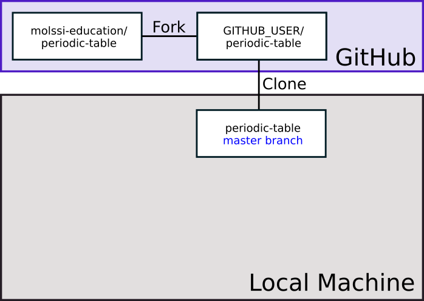
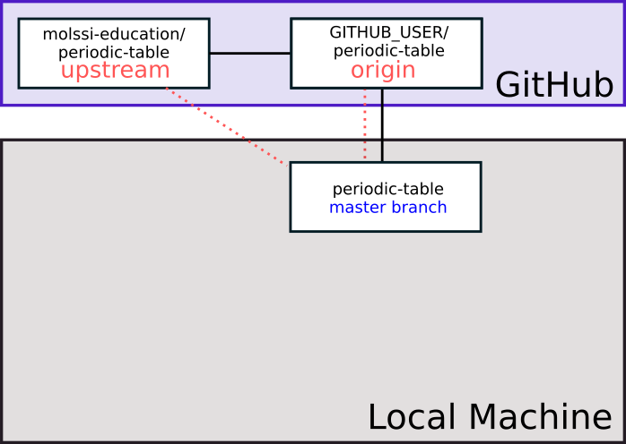
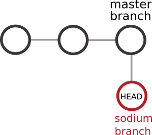
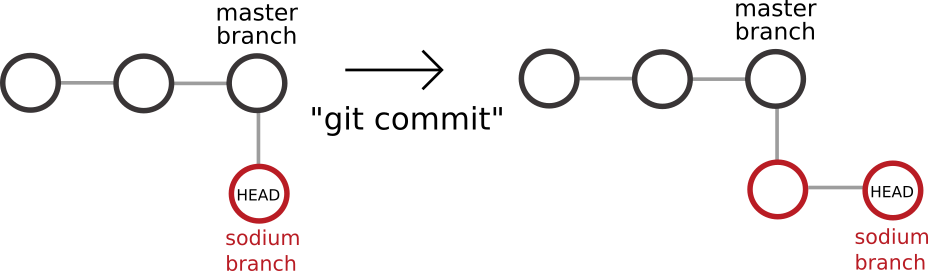
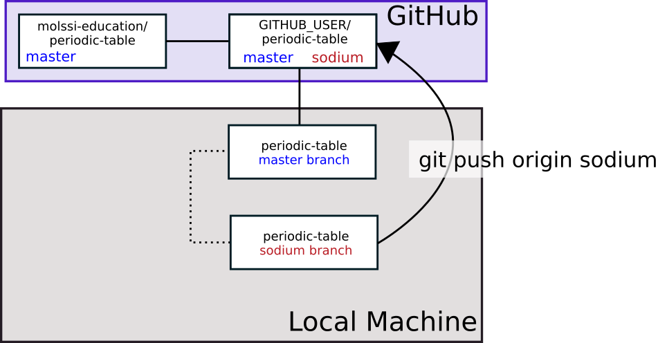
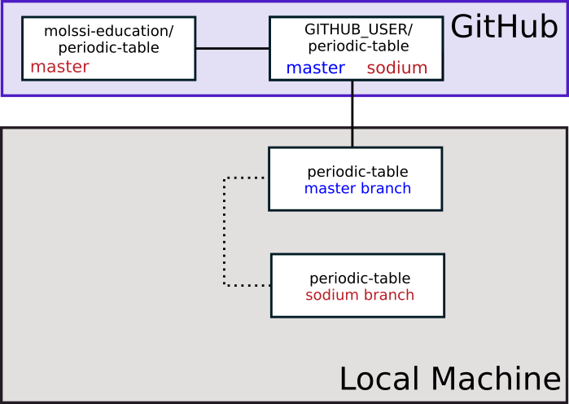
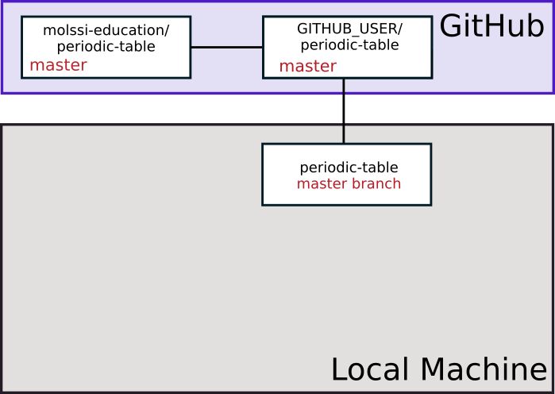

## Repository collaborators

Now that we know the basics of git, we might want to know about code collaboration. There are several ways for people to contribute to your project. If you are working with a small number of people who you know well, you may simply choose to add them as collaborators to your repo. This will give them the ability to push to your repository.

To add collaborators to your project, navigate to your repository on GitHub
Click the "Settings" button to the right of the little gear.
This will take you to some options that will help you to maintain your repository.

This page lets you do several important things, including rename, relocate, transfer, or delete your repository.

Underneath the "Features" heading you will notice an option to "Restrict editing to collaborators only".
This option prevents random strangers from being able to push changes to your repository, and should always be kept on.
To allow other people to work with you, you can assign collaborators.
Click the "Manage access" tab on the left. This will bring up a page where you can see some details about your repository. The box under the heading "Manage access" will allow you to invite collaborators to your project.

A pop up with a search bar will appear where you can search for the names of other github users.
By finding someone using the search bar and then clicking "Add collaborator", you can allow specific people to contribute to your project.
Generally speaking, you should only list someone as a collaborator if you work with them closely and trust that they won't do anything especially unwise with your repository.

Adding them to the repository as a collaborator will allow them to push to the repository the same way you do. 

People you don't know very well shouldn't be listed as collaborators, but there are still ways for them to contribute improvements to your project.

### Protecting your Master Branch
If you choose to work with collaborators, there are still ways for you to protect your code. Click the "Branches" tab. You will see a heading which says "Branch protection rule". Adding the name of a branch here will make it a "protected branch" and the rules you choose in the section below will protect the branch (under the heading "protect matching branches"). For example, you may want to choose to protect the `master` branch so that pull requests and reviews are required to change the branch. This way, your collaborators will not be able to push to the master branch, and must submit a `pull request` more on this later in order for their changes to be incorporated. You can read more about branch protection [here](https://help.github.com/en/enterprise/2.18/admin/developer-workflow/configuring-protected-branches-and-required-status-checks#enabling-a-protected-branch-for-a-repository).

### Pull Requests - Branch and Pull Request (PR)
Protecting your master branch will require contributors to submit their changes through a process called a Pull Request. As the repository owner, you can also change the code through a pull request on GitHub.

Previously, we discussed that all changes should take place on branches. This is still true, however, we are now going to incorporate those changes through a pull request on GitHub rather than through a merge.

Create a new branch in your repository to make a small change.

~~~
$ git checkout -b collab_instructions
~~~
{: .language-bash}

Add the following to your README and commit the change.

~~~
To submit your feature to be incorporated to the master branch, you should submit a `Pull Request`. The repository maintainers will review your pull request before accepting your changes.
~~~

~~~
$ git add README.md
$ git commit -m "add collaboration instructions to readme"
~~~
{: .language-bash}

We want these changes incorporated into the master branch. You could do as we did before and switch to the `master` branch, `merge` then changes, and push to GitHub for the changes to be present there on the `master` branch. If you are the repository owner, this will work even if you have branch protection rules. However, if you are not, your push from master will be rejected by GitHub.

We will want to push to a new branch on the repo then open a pull request. 

~~~
$ git push origin collab_instructions
~~~
{: .language-bash}

You will get an output similar to the following:

~~~
Enumerating objects: 5, done.
Counting objects: 100% (5/5), done.
Delta compression using up to 8 threads
Compressing objects: 100% (3/3), done.
Writing objects: 100% (3/3), 470 bytes | 470.00 KiB/s, done.
Total 3 (delta 2), reused 0 (delta 0)
remote: Resolving deltas: 100% (2/2), completed with 2 local objects.
remote: 
remote: Create a pull request for 'collab_instructions' on GitHub by visiting:
remote:      https://github.com/YOUR_USERNAME/molecool/pull/new/collab_instructions
remote: 
To https://github.com/YOUR_USERNAME/molecool.git
 * [new branch]      collab_instructions -> collab_instructions
~~~
{: .output}

This message tells you that a new branch has been created on your repository, and also tells you that you may want to open a pull request. You can click this link or copy and paste it to open a pull request. Write a description of the pull request in the box, then click "Create Pull Request".

Once the PR is created, you will see a page describing the PR. On the top of the repo, you should see a button called "Pull Requests" and it should show that one is open for your repo. You can then choose to review the PR, or in this case you can just merge it without a review. To review a PR, click the 'Files changed' tab. You can review the changes (green Review changes button). Since you are looking at your own PR, you won't be able to "Approve" if you have put in the branch protection rule. However, you can comment on and merge the changes if you wish.

This kind of workflow is fine if you and everyone contributing has write access to the repo. However, this will sometimes not be the case and you will want to contribute to repos where you do not have write access. In the next couple of sections, we will explore how this works in detail.

## Forks

We have seen how it is possible to allow other people to contribute to a project by listing them as collaborators.  This works fine for a project that only a handful of people work on, but what about large open-source projects that might have hundreds of people who are interested in adding their own features?  No one wants to add all of those names to the list of collaborators, and giving everyone who asks the ability to push anything they want to the repository is guaranteed to lead to problems.  The solution to this question comes in the form of “forks.”

Unfortunately, the word “fork” has multiple possible meanings in the context of open-source software development.
Once upon a time, open-source software developers used the word “fork” to refer to the idea of taking an existing software project, making a copy of it, changing the name, and then developing it completely independently of the original project.
For the purpose of this discussion, every time we use the word “fork,” we mean what happens when you push the fork button in GitHub.

A fork is a copy of a repository that is largely independent of the original.
The maintainer of the original repository doesn’t have to do anything or know about the existence of the fork.
Want to make changes to an open-source project, but aren’t listed as a collaborator on the project?  Just make a fork, which you own and can manage in the same way as any other repository that you create on GitHub.
If you want to submit changes to the project’s official repository, you can create a “pull request”, which we will discuss in more detail in the next section.

For now, we will learn how to create and maintain a fork.

During this section, we will all fork a central repository, make changes, then submit something called a Pull Request to have those changes incorporated into the code. We will leave the package we are developing for this section.

Navigate to the URL https://github.com/molssi-education/periodic-table in your web browser. You should see a GitHub repo. This repository contains code to make a website which has the periodic table. View the website https://molssi-education.github.io/periodic-table/ . On the website page, elements which appear with a red background have a page and information filled in. You can read more about each element by clicking on it. Elements with a white background do not yet have a page. Take a minute or two to click around. 

Create a personal fork of the repository by pressing the “Fork” button near the top right of the web interface. GitHub will copy the repository to your profile. It should automatically redirect when it's done. You should notice at the top of the page, the name of the repository has a 'fork' symbol by it. It should say 'YOUR_USERNAME/periodic-table', and under that say 'forked from molssi-education/periodic-table.'

You can use the following diagram to visualize what you just did.

Then, make a clone of the fork on your personal computer. Before you make the clone, MAKE SURE YOU ARE NOT IN A GIT REPOSITORY.

Type

~~~
$ git status
~~~
{: .language-bash}

You should see the message

~~~
fatal: not a git repository (or any of the parent directories): .git
~~~
{: .output}

If you do not see this message, navigate using `cd` until you do.

Next, clone the repository to your computer. Use the green button (Clone or download) on your fork to get the fork URL.

~~~
$ git clone <fork URL>
$ cd periodic-table
~~~
{: .bash}

Now, when we visualize what our repositories look like, we have a copy of our fork on our local machine. 

In a real development situation, we would also create a new `conda` environment for developing in this repository.

## Adding an upstream to our forks
In your terminal window, type
~~~
$ git remote -v
~~~
{: .language-bash}

You should see output similar to the following

~~~
origin https://github.com/YOUR_GITHUB_USERNAME/periodic-table.git (fetch)
origin https://github.com/YOUR_GITHUB_USERNAME/periodic-table.git (push)
~~~
{: .language-bash}

This is similar to our own repository. However, since this is fork, we will want to add another remote to track the original repository. The standard names for remotes are `origin` for the repository we have cloned from, and `upstream` for the repository we forked from. Add an upstream using the following command

~~~
$ git remote add upstream https://github.com/molssi-education/periodic-table.git
~~~

Now, when you check the remotes (`git remote -v`), it should list both the `origin`, and `upstream` repositories. If we wanted to pull changes from the original repo, we could do `git pull upstream branch_name`

Next type

~~~
$ git fetch upstream
~~~
{: .bash}

To get a copy of the upstream repository. This will be in a hidden branch. You should be able to see both the origin and upstream hidden branches by typing

~~~
$ git branch -a
~~~
{: .bash}

We will use remotes/upstream/master to keep track of new changes that happen upstream that we do not have in our local master.

# Developing a new feature - creating branches
We will implement a new element for the webpage.

Create a new branch in your repo with your element of choice. For this demo, I will be editing the sodium page. You should choose another element. This can either be an element that exists (red background), or an element that doesn't exist yet (white background).

~~~
$ git checkout -b sodium
~~~
{: .language-bash}

This command creates the branch and checks it out (the `-b` stands for `branch`). Alternatively, we could have used the commands `git branch sodium` and `git checkout sodium`. In general, your branch name should describe the feature or changes that you plan to make on the branch.

You will see the output

~~~
Switched to a new branch 'sodium'
~~~
{: .output}

We have now created a new branch called `sodium` and checked it out.

## More about branching
When creating a new feature, it is a good practice to develop each feature on a new branch in the new repository.  Branching in git is exactly what it sounds like. You can create a branch from a certain commit (when using the `git branch` command), and when you switch to that branch, it is an independent copy of the repository moving forward from that branch point. 

Before branching, imagine a git commit history that looks like this. In the diagram below, each circle represents a git commit. There have been two commits, and the HEAD is currently after commit 2.

After we have created a new branch and checked it out, we can imagine our git history looking like this. The sodium branch 'branches' or starts from the point where we used the git branch command. 

Now, when we make a commit on the `sodium` branch, our changes will continue from this point, leaving the master branch unchanged. Note that we have not yet made a commit, but this diagram is for illustrative purposes.

## The importance of branching

When you are doing development, particularly on a fork (but also if you are collaborating), it is very important that all development work be done on a branch. In the case of a collaborative repository where you are pushing directly, this will allow you to do pull requests from branches (more on pull requests below), and that your code is reviewed by another developer on the project before being merged to the master branch.

The most important reason to work on a branch is to keep your master branch clean. In the workflow you are learning today, the master branch should track upstream, and only be changed by pulling from upstream. This will ensure that you **always have a working piece of software on the master branch.** It will make it easier to correct mistakes if they arise, and keep your repository clean if you have multiple collaborators. 

## Editing our element

Now it's time to edit our periodic table element. If you have picked an element which exists already, there will be a file with the name `element_name.md` where element name is the element you've chosen. If the file does not exist, create it.

For example, to create the sodium file, 

~~~
$ touch sodium.md
~~~
{: .language-bash}

Once the file is created, open it in your text editor of choice. It is important that every element have the following at the top of the page (note - spacing is very important!)

~~~
---
layout: page
title: ELEMENT_NAME
---
~~~

If you are creating a new page, fill in the appropriate element name. Add some text about the element below the heading. For example, our sodium page might look like the following.

~~~
---
layout: page
title: Sodium
---

Symbol : Na  
Atomic Number : 11  
~~~

Save your file after you edit it.

## Testing out the website

If you have [jekyll](https://jekyllrb.com) installed, you can view a local copy of the webpage. This is not a necessary step. If you do not have jekyll installed, or do not wish to install Jekyll skipt this step. 

Execute the command

~~~
$ bundle exec jekyll serve
~~~
{: .language-bash}

in the terminal the top level of your project to render a local copy of the webpage. Naviage to the local address to view your website and make sure your new element is working. 

## Committing the change

Let's add and commit these changes.

~~~
$ git add elements/YOUR_ELEMENT.md
$ git commit -m "update YOUR_ELEMENT page"
~~~
{: .bash}

Next, we must push these changes. But, where do we want to push the changes? We would like to have our changes incorporated into the central repository, but do not have permission to push upstream. We will have to push to origin (our repository) on the `sodium` branch (or whatever branch you're working on), then we will request that the maintainers of the upstream repository incorporate our changes, or pull from our repository. This is why it is called a `Pull Request`. We are literally requesting them to pull from our repository.

~~~
$ git push origin sodium
~~~
{: .bash}

Here, the last line indicates that we are pushing to `origin` (our fork) to the `sodium` branch. The branch name you type in place of sodium should match the name of the branch you are working on. If you view your repository on GitHub, you should now see that you have another branch in addition to the master branch.

As part of the output from this command, you should see the following:

~~~
remote:
remote: Create a pull request for 'sodium' on GitHub by visiting:
remote:      https://github.com/YOUR_GITHUB_USERNAME/periodic-table/pull/new/sodium
remote:
~~~
{: .output}

`git` is correct. What we will want to do next is create a pull request on the original repository to get our changes incorporated.

## Pull requests

It is now time to incorporate the edits you have made in your fork into the original repository.
To do this, we must create a `Pull Request`.

Navigate to the URL of your fork. You should see a highlighted area and green button which says "Compare and Pull Request". Alternatively, you can navigate to the URL given in the message where you did a push.

Once you are on the page that says "Open a pull request", you should see fields which ask for the name of the pull request, as well as a larger text box which has space for a description. Make the title of this pull request "add sodium page". Edit the description to describe what you have done in your pull request.

Submit the pull request.

Now, the maintainers of the repository can review your material, and request changes if they feel it necessary. 

Anyone can see Pull Requests on public repositories. Try reviewing a few pull requests on the periodic table repository. You can leave comments/reactions. Take a few minutes to review someone else's pull request.

Once your changes have been accepted, upstream will have those changes on the `master` branch. This is indicated in the figure below through the change in color of the the word 'master'. 

## Incorporating upstream changes to local

After your change has been accepted to upstream, you will want to incorporate the changes into your local master branch. First, switch to your master branch.

~~~
$ git checkout master
~~~
{: .bash}

You can get changes to your local master by either doing a `git pull` from upstream master, or by doing a `git fetch` from upstream master, followed by a merge. For now, just do a pull.

~~~
$ git pull upstream master
~~~
{: .bash}

Next, you will want to update your origin master. Push from the local master to origin.

~~~
$ git push origin master
~~~
{: .bash}

Now, your upstream master and origin master should be at the same point.

If you are done working with your feature branch, you can now delete it. 

~~~
$ git branch -d sodium
~~~

The `-d` option means to delete the branch.

To delete the branch on your origin repository on GitHub, you can use teh command

~~~
$ git push origin --delete sodium
~~~
{: .bash}

## More Tutorials
If you want more `git`, see the following tutorials.

### Branching

[Git Branching Tutorial](https://git-scm.com/book/en/v2/Git-Branching-Basic-Branching-and-Merging)

### Rebasing

[Git Rebasing Tutorial](https://git-scm.com/book/en/v2/Git-Branching-Rebasing)
