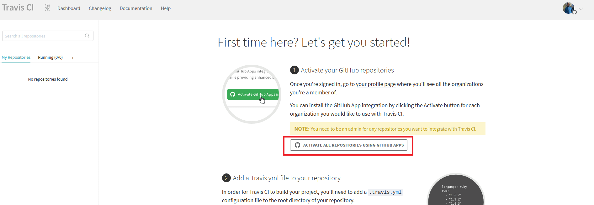
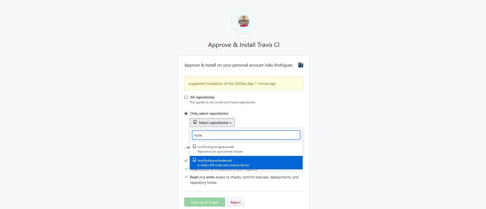
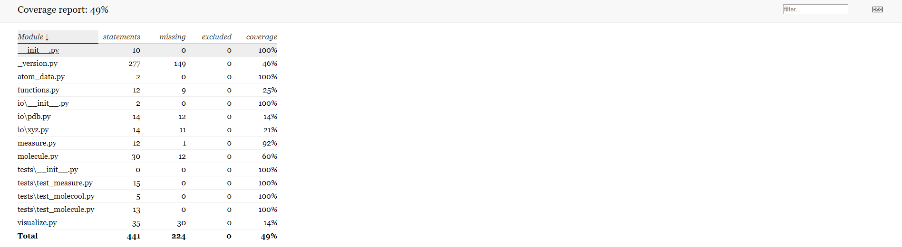

> ## Prerequisites
>
> - All Python code and tests described so far in the lesson.
> - Configured Git and GitHub account (described in set-up)
> - Pushed up-to-date version - with tests - of the `molecool` project to Github.
{: .prereq}

From [Wikipedia](https://en.wikipedia.org/wiki/Continuous_integration), continuous integration (CI) is the practice of merging all
developers' working copies of code to a shared mainline, several times a day. In other words, CI refers to the coupling of
version control and unit testing in an automated way. Typically, CI runs either when you commit new code to your project, or beforehand,
when you try to merge experimental code into the main repository (through a pull request). CI is useful not only for catching bugs before
they reach your fellow developers and your end users, but also for expanding your testing to platforms that are not available to you.

Most CI services are tightly integrated with Github. In this episode, we will be using [TravisCI](https://travis-ci.org), since it
is free for open-source projects and integrates nicely with Github. Other options you might consider include [CircleCI](https://circleci.com), [Azure Pipelines](https://azure.microsoft.com/en-us/services/devops/pipelines/), and the more recent
[Github Actions](https://github.com/features/actions). 

Using any of these services is essentially getting access to empty remote computers that we can configure as we wish. In order
to test our projects using Travis, we will have to set up the correct environment and tell Travis what to do.

> ## travis-ci.com vs travis-ci.org
>
> If you type TravisCI in your favorite search engine, you will find two official websites, one ending in `.com` and another in `.org`.
> You should click on`travis-ci.com`. The `.org` website used to be specifically for open-source projects, but Travis has since
> merged both services. As a student, you can get the 'Bootstrap' plan for free - see [here](https://education.travis-ci.com/).
{: .callout}

## Setting up TravisCI
All of Travis' settings are stored in the `.travis.yml` file. Note the leading period, which makes this a hidden file in Linux and
Mac OS. Fortunately for us, CookieCutter created this file for us and set it up to run our tests with pytest. If you wanted, you could
go online to `travis-ci.org` right now, link it to your repository, and have Travis automatically execute your tests every time you
pushed to the repository. You wouldn't have to worry about how to configure Travis. However, we will go over this file in detail so
you can understand what is happening under the hood.

So far in this workshop, we have been working in the `molecool/molecool` and `molecool/tests` directories. We will now focus on
the `.travis.yml` file, in the root of your project, and on some other files in the `molecool/devtools` directory.

First, open the `.travis.yml` file. You will see something like the following at the top of the file:

~~~
language: python

# Run jobs on container-based infrastructure, can be overridden per job

matrix:
  include:
    # Extra includes for OSX since python language is not available by default on OSX
    - os: osx
      language: generic
      env: PYTHON_VER=3.6
    - os: osx
      language: generic
      env: PYTHON_VER=3.7

    - os: linux
      language: generic  # No need to set Python version since its conda
      env: PYTHON_VER=3.6
    - os: linux
      language: generic
      env: PYTHON_VER=3.7
~~~
{: .yml}

This first section of the file tells Travis which languages our project is written in, and which operating systems and Python versions
we want to run our integration on. CookieCutter set up su to test our code on four different systems: OSX with Python 3.6, OSX with Python 3.7, Linux with Python 3.6, and Linux with Python 3.7. By default, Travis will run Ubuntu for the Linux, and will automatically
pick the version of both OSX and Ubuntu for you. This is enough for us right now, but if you would want to specify exactly which versions
of the operative systems you wanted to run your tests on, you could!

Before we continue, the configuration file is written in YAML and adheres to a set of specifications. Keywords like `matrix`, `include`,
`before_install`, and `install` are specific to Travis and indicate several steps of the entire CI process. You can always refer to the
[documentation](https://docs.travis-ci.com/) for a list of all the avaialble keywords and a more in-depth explanation of each one.

The second section of the `.travis.yml` file sets up the testing environment. These commands will run on every combination of OS and Python version specified above.

~~~
before_install:
    # Additional info about the build
  - uname -a
  - df -h
  - ulimit -a

    # Install the Python environment
  - source devtools/travis-ci/before_install.sh
  - python -V
~~~
{: .yml}

The part of this script that really does something is the line `source devtools/travis-ci/before_install.sh`. This BASH script installs
Miniconda in the machine where the CI job is running and configures `conda` so that our project's dependencies can be installed. We install Miniconda, instead of using the system's Python installation, to have full control and reproducibility over the CI process. Once this section completes, Travis has an environment running a particular OS and version of Python, with Miniconda installed.

The next section of the configuration file gives instructions for creating a Conda environment and installing our package. As you can see, these are pretty much the same commands we would run on our terminal window.

~~~
install:

    # Create test environment for package
  - python devtools/scripts/create_conda_env.py -n=test -p=$PYTHON_VER devtools/conda-envs/test_env.yaml
    # Activate the test environment
  - conda activate test
    # Build and install package
  - python setup.py develop --no-deps
~~~
{: .yml}

The first line in this section, starting with `-python devtools/scripts`, creates a Conda environment named `test` using the Python script
`create_conda_env.py` and the conda requirements file `test_env.yaml`. This latter file is particularly important for us, since it tells
Travis what packages we need in our testing environment. As such, let's take a closer look.

Open `devtools/conda-envs/test_env.yaml` in your text editor.

~~~
name: test
channels:
dependencies:
    # Base depends
  - python
  - pip

    # Testing
  - pytest
  - pytest-cov
  - codecov

    # Pip-only installs
  #- pip:
  #  - codecov
~~~
{: .yml}

We can see that this file specifies what packages will be installed in this environment. There are the two base dependencies, `python` and `pip`, followed by dependencies specific to unit testing: `pytest`, `pytest-cov`, `codecov`. The last few lines are commented out, but allow you to install certain packages via `pip`, instead of `conda`. Sometimes, some dependencies are not available on any Conda channel but exist on [PyPI](https://pypi.org/).

The next line in the YAML file runs our unit tests and produces a coverage report. The command should look very similar to what you executed on your machine in the previous lesson. The only difference is the extra flag to include code coverage.

~~~
script:
  - pytest -v --cov=molecool molecool/tests/
~~~
{: .yml}

The last few lines in the `test_env.yaml` file specify that we do not want email notifications (Travis can be set up to send you updates when a build starts, fails, or succeed, via email, or even slack) and that, _if the tests run successfully_, we want to upload our coverage to [Codecov](https://codecov.io/). We will cover this other CI service later in this episode.

> ## Exercise
> By default, Travis is triggered when you commit to any branch of your repository, or when someone opens a new pull request.
> The free tier of Travis allows only a few concurrent jobs, so it is in your best interest to try and limit the number of events that
> might trigger new CI runs. For example, it might be useful to only trigger Travis if there is a commit or a pull request on the `master`
> branch.
>
> Edit the beginning of your `test_env.yaml` file to include the `master` branch in the safelist for Travis builds. You can find the 
> appropriate syntax on the Travis documentation [here](https://docs.travis-ci.com/user/customizing-the-build#building-specific-branches).
>> ## Solution
>> The first few lines of your `test_env.yaml` should look like this once you are done with your edits:
>>
>> ~~~
>> language: python
>> 
>> branches:  # limit Travis CI runs to events on the master branch
>>   only:
>>     - master
>> 
>> # Run jobs on container-based infrastructure, can be overridden per job
>> 
>> matrix:
>>   include:
>> ~~~
>> {: .yml}
> {: .solution}
{: .challenge}

> ## Tests, coverage, and much much more!
> We finished setting up our CI workflow with Travis, using the defaults included in the CookieCutter template. This is one way to do it,
> however, note that there are many ways you could have configured this workflow with the exact same effects. Similarly, you can use 
> Travis to run more than just pytest. Several open-source projects use Travis and other CI services to automate multiple steps of their 
> development pipeline, namely style checking, unit testing, building documentation, and even building and uploading packages to conda 
> and PyPI.
{: .callout}

## Setting up travis-ci.com
Now that you set up all the configuration files for Travis to run successfully, you have to hook it to your Github repository. First, however, push your edits to your Github repository. Also, check if all the tests are passing. Although Travis will eventually start running your tests for you, you still don't want to push code without running the test suite locally.

Type the following at the root of your repository:

~~~
$ pytest -v
$ git add .
$ git commit -m "Setup Travis CI configuration"
$ git push origin master
~~~
{: .language-bash}

Once your repository on Github is up to date, open your browser and head to `https://travis-ci.com`. Sign in with your Github account and authorize Travis CI to access your personal Github account. After you are done, you should be redirected to this 'Getting Started' page on the Travis dashboard:
 

 
Click on the `Activate All Repositories Using GitHub Apps` prompt highlighted in red in the screenshot above. Despite its description, this button leads us to a page where we can pick which repositories we want to associate with Travis. Click on `Only select repositories` and select the `molecool` repository from the dropdown. Tip: start typing the name of the repository to narrow down the choices. Once you find the repository, click on the green `Approve & Install` button at the bottom of the form.

 

 
You will then be redirected back to your Travis dashboard. Sometimes, you will be asked to activate the 'Github Apps Integration', which you just did. Ignore that and click on the `Dashboard` link on the top of the page. You should now see the `molecool` repository under the 'Active Repositories' tab. You can click on the name of the repository to open its build history.

Because we pushed _before_ setting up our Travis account, we have not triggered any CI runs yet. A simple way to trigger a CI run is just to push to the repository. Alternatively, you can also using the web page you are on to ask Travis to run. Click on the `More options` button on the right of the screen and then on `Trigger build`. Then, click on the `Trigger custom build` buttom at the end of the form.

 

 

Travis will now start running the workflow we defined in the `test_env.yaml` file. You should see different entries under the `Build jobs` tab, one for each combination of OS and Python version you specified in the settings. After a minute or two, the jobs should complete. If a job is successful, there will be a green checkmark next to its entry, otherwise there will be a red cross.

Unfortunately, our CI runs failed. To know more about why this was the case, we have to read the Travis log files. Click on one of the failing entries. The new page you will be redirected to has details about the job at the top and then the contents of the log file underneath. Look for red lines that indicate errors in your build.

Our tests failed because `numpy` could not be imported. When we set up the dependencies, we did not explicitly write either `numpy` or `matplotlib`. As such, when Travis creates and configures the machines where our CI runs, these packages are never installed. We need to add them to the `devtools/conda-envs/test_env.yaml` file.

> ## Exercise
> Add two lines to the `test_env.yaml` specifying `numpy` and `matplotlib` as dependencies that should be installed
> in our CI environment.
>> ## Solution
>> Your `test_env.yaml` should look like this once you are done with your edits:
>>
>> ~~~
>> name: test
>> channels:
>> dependencies:
>>    # Base depends
>>  - python
>>  - pip
>>
>>  # Package dependencies
>>  - numpy
>>  - matplotlib
>>
>>    # Testing
>>  - pytest
>>  - pytest-cov
>>  - codecov
>>
>>    # Pip-only installs
>>  #- pip:
>>  #  - codecov
>> ~~~
>> {: .yml}
> {: .solution}
{: .challenge}

After these edits, commit and push to the repository. Travis will now detect a new commit and will start a new build automatically. On your Travis dashboard, select the `molecool` repository again to see a new CI build running. After a minute or two, you should see green checkmarks next to your build jobs. Congratulations! Travis CI is now set up and tracking your repository.

> ## Exercise
> Besides providing most of the setup for Travis, the CookieCutter also gives us some eye-candy for our repository. Github repositories
> often have so-called 'badges' on the `README.md` files. These badges inform on several aspects of the repository, including if the
> current commit is passing or not the tests.
>
> Edit your `README.md` file to fix the link to the Travis CI status badge. You should replace the `REPLACE_WITH_OWNER_ACCOUNT` 
> placeholder with your Github username. After committing, enjoy the new (hopefully green!) badge!
{: .challenge}

## Code Coverage - Part II
In the previous episode, we introduced the concept of code coverage as a measure of how much of our code is run by our unit tests. Projects should aim for a high coverage percentage, but not obsess over the number. Remember that even if your project has 100% coverage, it does not mean it is actually bug-free.

When we run `pytest`, we can get a summary of our coverage with the `--cov=molecool` option. While this summary is helpful, it would be much more useful to know _which_ lines are covered by our tests. In the following section, we will explore two methods that allow us to do just that.

### Assessing code coverage locally
Besides coverage summaries, the `pytest-cov` module can also produce details reports. Run the following command at the root of your project to generate a report in HTML format:

~~~
$ pytest -v --cov=molecool --cov-report=html
~~~
{: .language-bash}

This command runs the tests as normal and in addition, creates a folder `htmlcov` that contains web pages highlighting the lines on each of our files that are covered by tests. Go ahead and open the file `htmlcov/index.html` on your web browser.

 

 

The report page shows all the modules in your project, along with the number of lines (statements). More importantly, it lists how many of these lines are not covered by tests (missing) as well as the coverage percentage. These percentages depends on how you wrote your functions and your tests, so don't worry if those of the image above are slightly different.

Click on the `measure.py` file name to see exactly which lines are missing from our tests. The colors indicate which lines are covered (in green) and which are not. We can see that in our `calculate_angle` function, the return value in radians is never checked by our tests. Let's go ahead and fix that by writing a new test.

> ## Exercise
> Write a new test in `tests/test_measure.py` to check that `calculate_angle` returns the
> correct value when `degrees=False`. Then run `pytest` again to update the coverage report.
>> ## Solution
>> ~~~
>> def test_calculate_angle_radians():
>>     """Test the calculate_angle function with output in radians"""
>> 
>>     r1 = np.array([1, 0, 0])
>>     r2 = np.array([0, 0, 0])
>>     r3 = np.array([0, 1, 0])
>> 
>>     expected_value = 90 * (np.pi / 180)
>> 
>>     calculated_value = molecool.calculate_angle(r1, r2, r3)
>>     assert expected_value == calculated_value
>> ~~~
>> {: .language-python}
> {: .solution}
{: .challenge}

If you refresh the coverage page on your browser (or re-open it if you closed it before), you will see that
`measure.py` now has 100% coverage.

### Adding code coverage to your CI workflow
Besides running tests for you, Travis can interface with other CI services to help you get reports on code coverage. In this last
section, we will introduce [Codecov](https://codecov.io/), one of many services that was created to help developers assess which areas
of their projects lack sufficient test coverage. Like Travis, Codecov is free for open-source projects and integrates very nicely with
Github.

On your browser, navigate to `https://codecov.io/` and click on the `Sign up` button. As with Travis, you can sign up/in with your Github account. When Codecov presents you with the list of projects it got from your Github account, pick your `molecool` repository. But, how does Codecov know about `molecool` already?

The last line of our `.travis.yml` configuration file is a call to an executable called `codecov`. The CookieCutter includes this utility program and sets it up automatically for us. As a result, when our CI workflow runs successfully (all tests pass), Travis runs `codecov`, which send statistics of our test coverage automatically to Codecov.io. Neat!

Back to the Codecov `molecool` report page, the sunburst plot gives a hierachical view of our project and its coverage. 

 

 

Red areas represent code that is poorly covered by our tests. On the right, you see the latest commits and can click on each one of them to see how they changed overall coverage of the project. It is possible, although outside the scope of this episode, to setup Travis to fail if a commit lowers the coverage of our codebase. The bottom of the page shows a simple file-browser like interface, much like the HTML page we obtained before.


